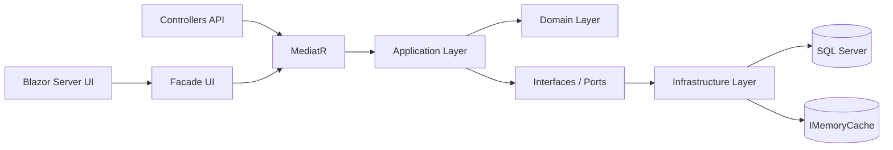
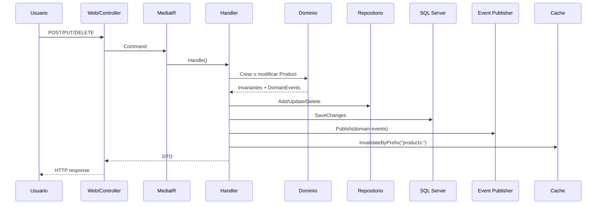
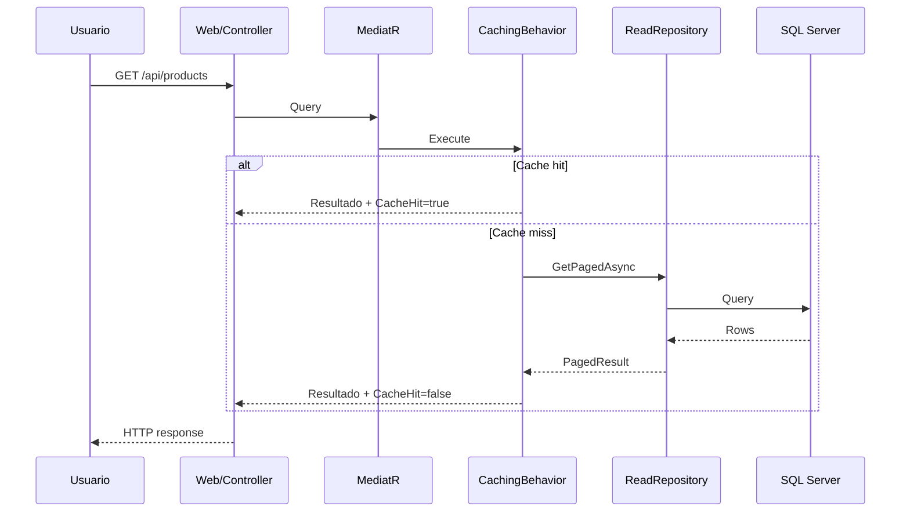

# ProductCatalog

Prueba tecnica Senior .NET construida con `Clean Architecture`, `CQRS`, `Blazor Server`, `Controllers` completos, `SQL Server`, `EF Core`, `Serilog`, cache en memoria, idempotencia persistida y trazabilidad BDD.

## Resumen

Este repositorio implementa un catalogo de productos con enfoque de dominio primero. La solucion protege invariantes de negocio en capa `Domain`, orquesta casos de uso con `MediatR` en `Application`, persiste con `EF Core` y `SQL Server` en `Infrastructure`, y expone UI + API desde un host unico `Blazor Server + Controllers` en `Web`.

La meta del proyecto no fue solo cumplir CRUD, sino dejar evidencia tecnica defendible:

- reglas de negocio encapsuladas en agregado y value objects
- handlers pequenos y enfocados
- eventos de dominio publicados solo despues de persistencia exitosa
- `ProblemDetails` consistente en API y UI
- validacion automatizada con tests unitarios, integracion, arquitectura y BDD ejecutable

## Tecnologias utilizadas

- `.NET 8`
- `ASP.NET Core`
- `Blazor Server`
- `Controllers` MVC / Web API
- `EF Core 8`
- `SQL Server`
- `MediatR`
- `FluentValidation`
- `AutoMapper`
- `Serilog`
- `IMemoryCache`
- `xUnit`
- `NetArchTest`
- `Docker` + `docker compose`

## Funcionalidad implementada

- Gestion de productos con listado, creacion, edicion y eliminacion
- Validaciones de nombre, SKU, precios, costo y stock
- Value objects `Money` y `Sku`
- Cache de consultas con metadatos de origen y tiempo de respuesta
- Idempotencia persistida para comandos con `RequestId`
- API REST bajo `/api/products`
- UI `Blazor Server` con validacion de formularios y chequeo asincrono de SKU
- `ProblemDetails` y `CorrelationId`
- Seeder idempotente para catalogo inicial
- Suite BDD ejecutable con 17 escenarios automatizados

## Arquitectura

La solucion esta separada en capas:

```text
src/
  ProductCatalog.Domain
  ProductCatalog.Application
  ProductCatalog.Infrastructure
  ProductCatalog.Web
tests/
  ProductCatalog.UnitTests
  ProductCatalog.IntegrationTests
  ProductCatalog.ArchTests
  ProductCatalog.Specs
docs/
  PLAN_PRUEBA_TECNICA.md
  BDD_TRACEABILITY.md
  DELIVERY_NOTES.md
  adr/
```

### Rol de cada capa

- `Domain`: agregado `Product`, value objects, especificaciones, excepciones y eventos de dominio
- `Application`: commands, queries, handlers, DTOs, validadores, behaviors y contratos
- `Infrastructure`: `DbContext`, migraciones, repositorios, cache, idempotencia, seeding y monitoreo
- `Web`: host unico con `Blazor Server`, `Controllers`, middleware y componentes UI

### Diagrama de arquitectura



### Flujo de una escritura



### Flujo de una consulta



## Decisiones tecnicas importantes

- Host unico: `ProductCatalog.Web` sirve UI y API para reducir friccion operativa y simplificar pruebas end-to-end
- Dominio primero: invariantes viven en agregado y no dependen de validadores externos
- Publicacion post-commit: eventos de dominio se despachan solo despues de `SaveChanges` exitoso
- Persistencia oficial: `SQL Server` es base objetivo para ejecucion local y evaluacion
- Orquestacion local: `docker compose`

ADRs:

- [ADR-001 Single Host With Blazor Server And Controllers](docs/adr/001-single-host-blazor-and-controllers.md)
- [ADR-002 Publish Domain Events After Commit](docs/adr/002-publish-domain-events-after-commit.md)
- [ADR-003 Use SQL Server In Docker For Local Runtime](docs/adr/003-use-sql-server-in-docker-for-local-runtime.md)

## Como funciona la arquitectura

### Dominio

El centro del sistema es el agregado `Product`. La idea principal es que un producto nunca quede en estado invalido. Por eso:

- `Product.Create(...)` valida nombre, precios y stock antes de devolver instancia valida
- `UpdatePrice(...)` y `AdjustStock(...)` pasan por reglas del dominio
- cuando una operacion compuesta puede fallar a mitad, `ExecuteAtomic(...)` toma snapshot y revierte estado
- los eventos `ProductCreated` y `ProductUpdated` se acumulan dentro del agregado y no se publican desde dominio

### Aplicacion

La capa de aplicacion coordina casos de uso, pero no define reglas de negocio.

- Los `CommandHandler` crean o modifican agregados y delegan persistencia
- Los `QueryHandler` piden datos a repositorios de lectura
- `ValidationBehavior` corre validadores estructurales
- `CachingBehavior` decide si la query se sirve desde cache o repositorio
- `LoggingBehavior` registra request, tiempo y resultado

### Infraestructura

La infraestructura implementa detalles tecnicos sin contaminar dominio:

- `AppDbContext` mapea entidades y converters
- `ProductReadRepository` optimiza lecturas con `AsNoTracking`
- `ProductWriteRepository` trabaja con tracking para persistencia
- `EfIdempotencyStore` guarda respuestas previas por `RequestId`
- `MemoryQueryCache` encapsula cache e invalidacion por prefijo
- `QueryInspectionInterceptor` registra queries lentas y heuristica N+1

### Web

El proyecto `Web` unifica UI y API:

- `ProductsController` expone el contrato HTTP
- paginas `Blazor` consumen una `Facade`
- `GlobalExceptionHandlingMiddleware` traduce excepciones a `ProblemDetails`
- `CorrelationIdMiddleware` agrega trazabilidad por request
- `CustomErrorBoundary` adapta errores tecnicos y de negocio a UX

## Guia de comportamiento del sistema

### Crear producto

1. UI o API recibe nombre, SKU, precio, costo y stock.
2. Validacion estructural revisa presencia, formato y reglas de entrada.
3. Se normaliza SKU.
4. El dominio valida invariantes.
5. Se persiste el producto.
6. Se publica `ProductCreated`.
7. Se invalida cache de listado.

### Actualizar precio

1. Se busca producto existente.
2. `UpdatePrice(...)` crea nuevos `Money`.
3. El dominio rechaza `PrecioVenta < Costo`.
4. Si pasa, se persiste.
5. Se publica un unico `ProductUpdated` representativo.

### Ajustar stock

1. Se calcula `Stock + delta`.
2. Si da negativo, dominio lanza excepcion.
3. Si pasa, se guarda y se invalida cache.

### Listar productos

1. Entra `GetProductsQuery`.
2. `CachingBehavior` busca por `CacheKey`.
3. Si hay cache, retorna resultado con `CacheHit=true`.
4. Si no hay, consulta repositorio, guarda resultado y retorna metadata.

### Idempotencia

Si un command llega con `RequestId` ya procesado dentro de la ventana configurada:

- no se reejecuta la operacion
- se devuelve la respuesta previa
- se evita duplicar escritura y eventos

## Reglas de negocio extraidas del codigo

Estas reglas no solo estan documentadas; salen directamente de como esta programado el dominio:

- El nombre del producto no puede ser vacio y debe tener entre 3 y 200 caracteres.
- El SKU no puede ser vacio.
- El SKU se normaliza con trim, mayusculas, espacios internos colapsados y guiones normalizados.
- El SKU solo admite caracteres alfanumericos y guiones.
- El precio y el costo no pueden ser negativos.
- El precio de venta no puede ser menor al costo.
- El stock final no puede ser negativo.
- Crear un producto genera `ProductCreated`.
- Cambiar precio o stock genera `ProductUpdated`.
- Si en el mismo ciclo el producto fue creado y luego modificado, se conserva evento representativo correcto.
- Los eventos no salen del dominio directamente; se publican despues de persistencia exitosa.
- Una operacion compuesta fallida no debe dejar el agregado en estado parcial.
- Los resultados de lectura pueden salir de cache, pero toda escritura invalida el cache relevante despues del commit.

## Guia para leer el codigo

Si alguien nuevo entra al repo, este es buen orden de lectura:

1. [Product.cs](/c:/Users/USER/source/repos/PruebaTecnicaArexdata/src/ProductCatalog.Domain/Entities/Product.cs:1)
2. [Money.cs](/c:/Users/USER/source/repos/PruebaTecnicaArexdata/src/ProductCatalog.Domain/ValueObjects/Money.cs:1)
3. [Sku.cs](/c:/Users/USER/source/repos/PruebaTecnicaArexdata/src/ProductCatalog.Domain/ValueObjects/Sku.cs:1)
4. [CreateProductCommandHandler.cs](/c:/Users/USER/source/repos/PruebaTecnicaArexdata/src/ProductCatalog.Application/Products/Commands/CreateProduct/CreateProductCommandHandler.cs:1)
5. [CachingBehavior.cs](/c:/Users/USER/source/repos/PruebaTecnicaArexdata/src/ProductCatalog.Application/Common/Behaviors/CachingBehavior.cs:1)
6. [AppDbContext.cs](/c:/Users/USER/source/repos/PruebaTecnicaArexdata/src/ProductCatalog.Infrastructure/Persistence/AppDbContext.cs:1)
7. [ProductsController.cs](/c:/Users/USER/source/repos/PruebaTecnicaArexdata/src/ProductCatalog.Web/Controllers/ProductsController.cs:1)
8. [ProductCreate.razor](/c:/Users/USER/source/repos/PruebaTecnicaArexdata/src/ProductCatalog.Web/Components/Pages/ProductCreate.razor:1)

## Endpoints principales

API expuesta desde `ProductsController`:

- `GET /api/products`
- `GET /api/products/{id}`
- `POST /api/products`
- `PUT /api/products/{id}`
- `DELETE /api/products/{id}`
- `GET /api/products/sku-exists`

UI principal:

- `/products`
- `/products/new`
- `/products/{id}/edit`

## Ejecutar con Docker

Prerequisito: Docker Desktop con `docker compose`.

1. Crear `.env` a partir de `.env.example` si quieres personalizar puertos, password o imagen SQL Server.
2. Ejecutar:

```powershell
docker compose up --build
```

3. Abrir:

- UI: `http://localhost:8080/products`
- API: `http://localhost:8080/api/products`

### Notas de Docker

- `sqlserver` usa por defecto `mcr.microsoft.com/mssql/server:2022-latest`
- `web` construye desde [Dockerfile](/c:/Users/USER/source/repos/PruebaTecnicaArexdata/Dockerfile:1)
- la base usa volumen persistente `sqlserver-data`
- la app aplica migraciones al iniciar y ejecuta seeding si la base esta vacia

Si ya descargaste manualmente la imagen de SQL Server y Docker Desktop insiste en resolverla otra vez, puedes forzar reutilizacion local:

```powershell
docker tag mcr.microsoft.com/mssql/server:2022-latest productcatalog-sqlserver-local:2022
$env:SQL_SERVER_IMAGE="productcatalog-sqlserver-local:2022"
$env:SQL_SERVER_PULL_POLICY="never"
docker compose up --build
```

El script [validate-docker.ps1](/c:/Users/USER/source/repos/PruebaTecnicaArexdata/scripts/validate-docker.ps1:1) intenta hacer este reuse automaticamente cuando detecta la imagen oficial ya descargada.

## Ejecutar sin Docker

Tambien puedes correr el proyecto contra una instancia local o remota de SQL Server:

```powershell
$env:ConnectionStrings__DefaultConnection="Server=localhost,1433;Database=ProductCatalogDb;User Id=sa;Password=SqlServerDev123!;TrustServerCertificate=True;Encrypt=False"
dotnet run --project src/ProductCatalog.Web/ProductCatalog.Web.csproj
```

Ejemplo con `SQLEXPRESS`:

```powershell
$env:ConnectionStrings__DefaultConnection="Server=.\\SQLEXPRESS;Database=ProductCatalogDb;Trusted_Connection=True;TrustServerCertificate=True"
dotnet run --project src/ProductCatalog.Web/ProductCatalog.Web.csproj
```

Launch profile local por defecto: `http://localhost:5173`.

## Pruebas y validacion

Comandos utiles:

```powershell
dotnet build ProductCatalog.slnx
dotnet test ProductCatalog.slnx -m:1
dotnet ef migrations list --project src/ProductCatalog.Infrastructure/ProductCatalog.Infrastructure.csproj --startup-project src/ProductCatalog.Web/ProductCatalog.Web.csproj --context ProductCatalog.Infrastructure.Persistence.AppDbContext
```

Scripts de validacion:

```powershell
powershell -ExecutionPolicy Bypass -File .\scripts\validate-local.ps1
powershell -ExecutionPolicy Bypass -File .\scripts\validate-docker.ps1
```

Estado validado en esta maquina:

- tests de arquitectura `4/4`
- tests unitarios `37/37`
- tests de integracion `25/25`
- specs BDD `17/17`

Cobertura de `ProductCatalog.Domain`: `80.36%`.

## Artefactos de apoyo

- [ProductCatalog.http](/c:/Users/USER/source/repos/PruebaTecnicaArexdata/ProductCatalog.http:1): pruebas manuales de API
- [PLAN_PRUEBA_TECNICA.md](/c:/Users/USER/source/repos/PruebaTecnicaArexdata/docs/PLAN_PRUEBA_TECNICA.md:1): plan vivo y seguimiento de tareas
- [BDD_TRACEABILITY.md](/c:/Users/USER/source/repos/PruebaTecnicaArexdata/docs/BDD_TRACEABILITY.md:1): trazabilidad de escenarios BDD hacia tareas
- [DELIVERY_NOTES.md](/c:/Users/USER/source/repos/PruebaTecnicaArexdata/docs/DELIVERY_NOTES.md:1): estado de entrega, pendientes y trade-offs

## Checklist de requisitos del TRD

### Estructura y arquitectura

- [x] Solucion organizada en `Domain`, `Application`, `Infrastructure`, `Web`
- [x] Suite de tests separada en unitarios, integracion, arquitectura y specs BDD
- [x] `Clean Architecture` respetada con pruebas de arquitectura
- [x] Host web con `Blazor Server` y `Controllers` completos

### Dominio

- [x] Agregado `Product` con invariantes estrictas
- [x] Excepciones de dominio propias
- [x] Rollback interno para cambios compuestos
- [x] Eventos `ProductCreated` y `ProductUpdated`
- [x] Estrategia de deduplicacion de eventos
- [x] Value Object `Sku` con normalizacion y validacion estructural
- [x] Value Object `Money` inmutable, con precision y operaciones seguras
- [x] Especificaciones de dominio composables y traducibles a expresiones

### Aplicacion

- [x] CQRS con `MediatR`
- [x] Commands y queries requeridos
- [x] Behaviors de logging, validacion y cache
- [x] Idempotencia basada en `RequestId`
- [x] `FluentValidation` por command
- [x] Cache con metadatos de fuente y tiempo de respuesta
- [x] Invalidacion de cache despues del commit
- [x] DTOs y perfiles de mapeo centralizados

### Infraestructura

- [x] `EF Core` con configuracion separada por `IEntityTypeConfiguration<T>`
- [x] Indice unico para `SKU`
- [x] `ValueConverter` para `Money` y `Sku`
- [x] Repositorios separados de lectura y escritura
- [x] Ordenamiento dinamico sin `switch` exhaustivo
- [x] Seeder idempotente con catalogo inicial
- [x] Interceptor para queries lentas
- [ ] Outbox Pattern persistido

### Interfaz

- [x] `/products`
- [x] `/products/new`
- [x] `/products/{id}/edit`
- [x] Validacion por campo y errores globales
- [x] Submit deshabilitado con formulario invalido
- [x] Validacion asincrona de SKU con debounce
- [x] Uso de `CancellationToken` para cancelar validaciones anteriores
- [x] Indicador de fuente de datos y tiempo de respuesta
- [x] `CustomErrorBoundary`
- [x] Soporte de `ProblemDetails` en UI

### Testing y evidencia

- [x] Cobertura de dominio >= 80%
- [x] Tests unitarios de handlers
- [x] Tests de `Money`
- [x] Tests de `Sku`
- [x] Tests de contrato de mapeo
- [x] Tests de arquitectura
- [x] Test de integracion sobre persistencia vs eventos
- [x] `dotnet test` ejecutable sin configuracion manual adicional
- [x] Archivo `.http`
- [x] README con decisiones tecnicas y arranque
- [x] ADRs documentados
- [~] Historial Git atomico y descriptivo

### Operacion local

- [x] `dotnet run` funcional con connection string configurable
- [~] `docker compose up --build` preparado y validado parcialmente, sujeto al estado del engine/image store local de Docker Desktop
- [~] Persistencia tras reinicio de contenedores condicionada por estabilidad local de Docker Desktop

## Estado actual y pendientes

Lo implementado en codigo ya cubre dominio, aplicacion, infraestructura, UI, API y la mayor parte de evidencia tecnica.

Pendientes principales:

- cerrar smoke real de Docker app + SQL Server si Docker Desktop deja de fallar con su image store local
- validar persistencia tras reinicio completo de contenedores
- refinar historial Git para contar mejor la historia del desarrollo

## Bloqueos conocidos

Hoy el bloqueo principal no es el proyecto, sino Docker Desktop local:

- `docker compose config` es valido
- el compose de la app esta correcto
- el fallo observado fue de Docker Desktop al resolver o leer blobs locales de imagen SQL Server

## Enfoque BDD

El flujo de trabajo seguido en repo es:

1. definir escenario en `.feature`
2. mapear escenario a tareas en `docs/BDD_TRACEABILITY.md`
3. implementar codigo necesario
4. automatizar escenario cuando aplica
5. actualizar plan de ejecucion

Actualmente la suite BDD automatiza 17 escenarios y complementa tests unitarios, de integracion y de arquitectura.
